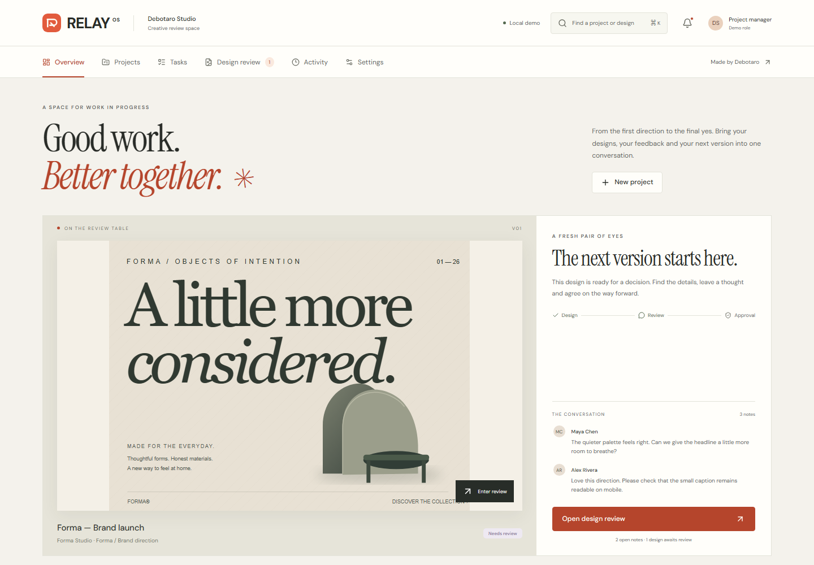
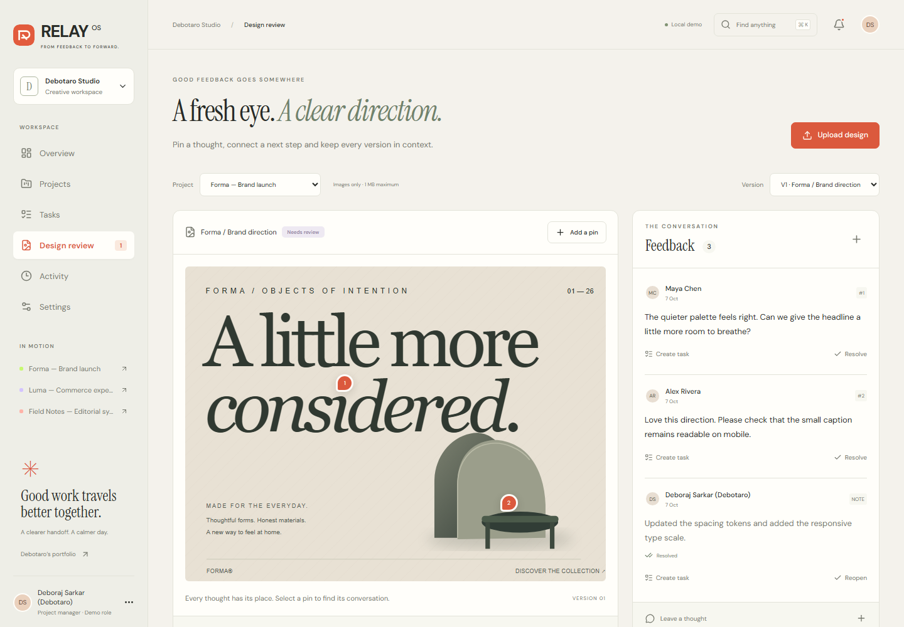
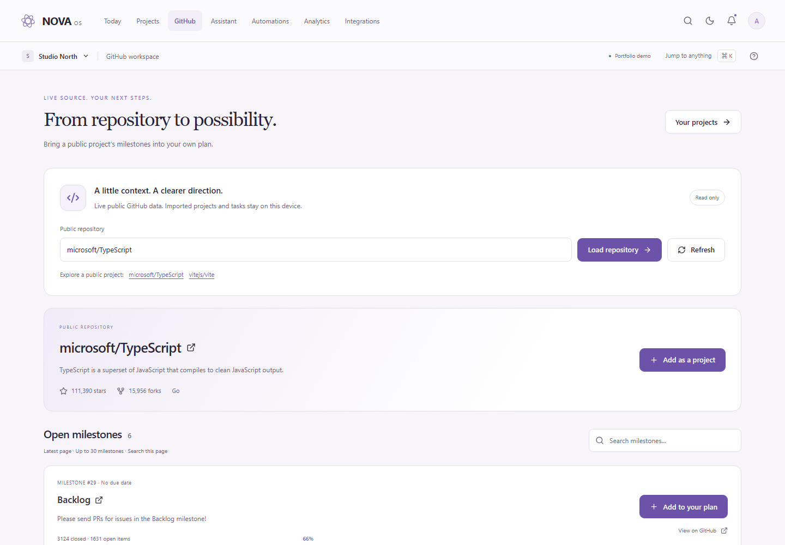

# Deboraj Sarkar (Debotaro) — Portfolio

[](https://github.com/Debotaro/Debotaro.github.io/actions/workflows/pages.yml)

**[View live portfolio](https://debotaro.github.io/)** · **[Download résumé](https://debotaro.github.io/downloads/Deboraj-Sarkar-Resume.pdf)** · **[Read case studies](CASE_STUDIES.md)** · **[Review validation](VALIDATION.md)**

[](https://debotaro.github.io/)

A personal portfolio for **Deboraj Sarkar**, also known as **Debotaro**, a **Frontend Developer** and Computer Science student based in **Kokrajhar, Assam, India**. He is pursuing a bachelor's degree at the **University of the People** (June 2025–present) and previously worked as a **Graphic Designer at Wecanstore.com** (June 2022–July 2023), creating digital banners, social media graphics and marketing materials.

The portfolio itself is featured first, followed by **seven independent, working project concepts**. Its custom D/T identity, live demos and eight case studies connect the work with his background, selected Coursera credentials and downloadable résumé. Deboraj's contribution across this collection is **visual direction, interface review and iteration; AI-assisted implementation**. He sets the visual direction, reviews generated interfaces, requests revisions and makes the final decisions. Technical descriptions and validation describe the project behaviour rather than independent coding or test authorship.

Seeking **full-time junior frontend/React roles**, available to start **within one week**, with remote opportunities and relocation for the right role. Contact: [mail.deborajsarkar@gmail.com](mailto:mail.deborajsarkar@gmail.com). Profiles: [GitHub](https://github.com/Debotaro), [LinkedIn](https://www.linkedin.com/in/deborajsarkar/) and [Dribbble](https://dribbble.com/Debotaro).

## Explore the seven demos

Project names open their source folders. Demo links open the published applications.

| Project source              | Live demo                                                          | Stack                                                 | Main interactions                                                                                                                                                   |
| --------------------------- | ------------------------------------------------------------------ | ----------------------------------------------------- | ------------------------------------------------------------------------------------------------------------------------------------------------------------------- |
| [RELAY OS](relay-os/)       | [Open creative workspace](https://debotaro.github.io/relay-os/)    | React, TypeScript, Vite; optional Supabase adapter    | Project/task planning, versioned design assets, image-pin feedback, comment-to-task conversion, approvals, activity, analytics, role previews, command search       |
| [NOVA OS](nova-os/)         | [Open workspace](https://debotaro.github.io/nova-os/app/)          | Next.js, TypeScript, Tailwind, Radix, GSAP            | Editable projects/tasks, live GitHub repository/milestone reads and local imports, assistant actions, command search, automation flows, analytics, persistent theme |
| [ATLAS Ops](atlas-ops/)     | [Open operations](https://debotaro.github.io/atlas-ops/#/overview) | React, TypeScript, Vite, Tailwind, Radix, Recharts    | Task CRUD and Kanban, live GitHub issue queue, safe local issue imports, chart filters/targets, coverage scheduling, notifications, CSV export                      |
| [NILA Ledger](nila-ledger/) | [Open ledger](https://debotaro.github.io/nila-ledger/#/dashboard)  | React, TypeScript, Vite, Tailwind, Recharts, GSAP     | Transaction CRUD and filters, accurate penny-based totals, adjustable budgets, CSV exports, printable reports                                                       |
| [AURA Reserve](aura/)       | [Explore AURA](https://debotaro.github.io/aura/)                   | One HTML file with embedded CSS/JS, optional GSAP     | Property gallery, availability calendar, stay dates, validated enquiry, sample price calculation                                                                    |
| [VANTA Atelier](vanta/)     | [Explore VANTA](https://debotaro.github.io/vanta/)                 | One HTML file with embedded CSS/JS                    | Collection filters, lookbook, product sizes, persistent cart, quantities, demo checkout                                                                             |
| [RASA Experience](rasa/)    | [Explore RASA](https://debotaro.github.io/rasa/)                   | One HTML file with embedded CSS/JS, optional Three.js | Destination globe, itineraries, travel quiz, journey enquiry, downloadable sample plan                                                                              |

**New capstone:** [Explore RELAY OS](https://debotaro.github.io/relay-os/) for a complete design-feedback-to-delivery journey. The public demo runs locally in your browser; optional Supabase setup is documented separately.

**New in NOVA:** [Explore the live GitHub workspace](https://debotaro.github.io/nova-os/app/github/) and turn public repository milestones into local planning tasks.

NOVA, ATLAS and RELAY use different information hierarchies as well as different visual identities. NOVA is a paper-and-lavender daily planning canvas with an agenda and task focus. ATLAS is a technical operations console with a monitoring rail, financial signals and priority interventions. RELAY is a warm creative review studio led by artwork, project covers, revisions and feedback. Their existing state, imports and review workflows remain connected to the redesigned views.

<details>
<summary>View screenshots of all seven demos</summary>

### RELAY OS — creative project handoffs

[](https://debotaro.github.io/relay-os/)

[](https://debotaro.github.io/relay-os/#/review)

### NOVA OS — connected project workspace

[](https://debotaro.github.io/nova-os/app/)

[](https://debotaro.github.io/nova-os/app/github/)

### ATLAS Ops — operational planning

[](https://debotaro.github.io/atlas-ops/#/overview)

### NILA Ledger — personal finance

[](https://debotaro.github.io/nila-ledger/#/dashboard)

### AURA Reserve — hospitality experience

[](https://debotaro.github.io/aura/)

### VANTA Atelier — editorial storefront

[](https://debotaro.github.io/vanta/)

### RASA Experience — travel discovery

[](https://debotaro.github.io/rasa/)

</details>

## Open the complete portfolio

Requirements: Node.js 24 and npm, matching the verified local and CI environment.

In PowerShell:

```powershell
Set-Location 'X:\Six Portfolio Projects\portfolio-website'
npm ci
npm run setup
npm run build
npm run preview
```

Open **http://localhost:4173**. The dependencies and builds are already present in this workspace, so you can simply run `npm run preview` here. The preview binds to the local computer only.

`npm run build` builds all four compiled apps and assembles a complete static bundle in `dist/`. It gives NOVA the `/nova-os` base path and retains relative assets in RELAY, ATLAS and NILA. `npm run dev` serves the same combined preview; it does not run app hot reload. Use the individual commands below while developing an app.

## Develop individual projects

Each app is independently installable and has its own package manifest and lockfile.

```powershell
# RELAY OS — Vite prints its selected port
Set-Location 'X:\Six Portfolio Projects\portfolio-website\relay-os'
npm ci
npm run dev

# NOVA OS — http://localhost:3101
Set-Location 'X:\Six Portfolio Projects\portfolio-website\nova-os'
npm ci
npm run dev

# ATLAS Ops — http://localhost:5174
Set-Location 'X:\Six Portfolio Projects\portfolio-website\atlas-ops'
npm ci
npm run dev

# NILA Ledger — Vite prints its selected port
Set-Location 'X:\Six Portfolio Projects\portfolio-website\nila-ledger'
npm ci
npm run dev
```

For standalone NOVA builds, remove `PORTFOLIO_BASE_PATH` from the environment before running `npm run build`. Its default output is `nova-os/out/`, suitable for a domain root. The combined build sets the path only for its child process, so it does not alter your terminal environment.

The three HTML experiences can also be opened independently through a local static server. The complete HTML/CSS/JavaScript for each lives in its respective `index.html`.

## Tests and screenshots

```powershell
# From portfolio-website, with the production build present:
npm run test:unit
npm run test:production
npm run test:install
npm run lint
npm run format:check
npm test
```

`npm run test:unit` runs RELAY's domain/backend contracts and ATLAS's storage-boundary checks. Embedded Postgres checks use test-only authentication/storage stubs; they do not connect to a live Supabase service. Playwright covers desktop/mobile Chromium, desktop Firefox and desktop/mobile WebKit. It checks user journeys, persistence, downloads, keyboard dialogs, automated accessibility, deferred delivery, fallbacks and layout. It starts a preview server if needed; reports appear in `playwright-report/` and ignored `output/quality-playwright.json`. WebKit emulation is separate from testing Safari on a physical iPhone.

`npm run lint` checks maintained JavaScript/TypeScript modules; `npm run format:check` checks source formatting. Use `npm run format` after editing. Embedded scripts in the single-file HTML demos are formatted and browser-tested; they are outside ESLint's module checks. The targeted cleanup extracts ATLAS's untrusted-storage parsing into a pure module rather than scattering type assertions through its UI.

The production build compacts only the portfolio and AURA/VANTA/RASA entry HTML, including embedded CSS and script whitespace. Editable source remains formatted. `npm run test:production` checks text separation, accessibility attributes, dynamic CSS and script execution. React and Next.js output keeps its existing compiler pipeline.

The [performance report](reports/performance/README.md) records matched mobile lab measurements, while the [accessibility review](reports/ACCESSIBILITY.md) retains both violations and uncertain checks. With a preview running, `npm run audit:accessibility` regenerates after results. The performance guide provides the browser executable and version requirements for `npm run audit:performance`. The [physical-device checklist](reports/REAL_DEVICE_CHECKLIST.md) records checks still requiring real phones and screen readers.

`node scripts/capture.mjs` refreshes the real project screenshots in `previews/`. These images also serve as the portfolio gallery thumbnails. After refreshing them, build again to update `dist/`.

See [VALIDATION.md](VALIDATION.md) for the verified checks and [CASE_STUDIES.md](CASE_STUDIES.md) for the design and engineering rationale.

## Demo behaviour

- RELAY is the seventh independent demo and the first app in the gallery. It connects local projects/tasks, design revisions, image-pin feedback, review decisions and an activity trail. Demo role switching previews Admin, Project Manager, Designer and Client permissions; it is not authentication. Its optional Supabase adapter and SQL/storage policies require a separately configured backend. The public browser demo does not provide live teamwork or cloud accounts. See [RELAY setup and scope](relay-os/README.md).
- Local business demonstrations use sample data. NOVA and ATLAS additionally read live public GitHub data. No backend or server account is required.
- NOVA's GitHub workspace reads public repositories and one page of up to 30 open milestones without credentials. Loading, empty, errors, retry, rate limits, a 12-second timeout and obsolete-request cancellation are handled. Importing a repository creates a local project; a milestone becomes one local planning task, not its individual issues. Duplicate guards, source links and import history persist when browser storage is available. Verified repository renames update source identities by stable ID. There is no application cache, automatic polling or GitHub write; local completion is independent of GitHub.
- ATLAS's GitHub queue additionally reads real public repository and issue data using credential-free GitHub REST requests. Loading, empty, errors, timeout, rate limits and stale requests are handled. Imports become browser-local tasks; they do not change GitHub. The queue shows one page of up to 30 raw entries with pull requests excluded.
- NOVA's assistant uses deterministic local rules. It creates and updates real local demo tasks, but does not call an AI API.
- Login, signup, onboarding and booking actions are clearly identified simulations. NOVA's GitHub workspace reads real public data; its other integration cards remain local previews. The public demos do not authenticate users, connect private accounts, send email, reserve rooms, purchase products or charge money. RELAY includes optional backend code for separately configured Supabase authentication and persistence; this is not enabled by the static demo.
- RELAY, NOVA, ATLAS, NILA and VANTA store demo state in browser local storage. NOVA validates supported records, relationships and storage size before restoration/saving, reports invalid saved data, and warns when saving is session-only. Its import activity is capped at 100 entries. ATLAS and NILA include confirmed reset controls. Local state belongs to the current browser and origin. Changing the host/port starts a separate storage context.
- Resort and travel enquiry details are used for the on-screen confirmation and are not saved. VANTA does not retain checkout identity or address.
- CSV files and the RASA text itinerary are real downloads. NILA's PDF action opens browser printing; choose **Save as PDF** to create a file. It is not a server PDF generator.
- Fonts, illustrative photographs and optional visual libraries need an internet connection. Native system fonts and accessible controls remain usable if external resources fail. RASA's destination buttons work without WebGL. Photography has replacement comments in the source.

## Source and publishing

Public source: [Debotaro/Debotaro.github.io](https://github.com/Debotaro/Debotaro.github.io). The domain-root GitHub Pages target is [debotaro.github.io](https://debotaro.github.io/). `.github/workflows/pages.yml` installs the locked dependencies, builds all seven projects, runs RELAY's domain/backend contracts and desktop/mobile browser checks, and deploys the verified `dist/` artifact on `main`. Pull requests run the same checks without deploying. The Pages source is configured as GitHub Actions.

**Three single-file experiences:** publish the contents of `aura/`, `vanta/` or `rasa/` as a GitHub Pages source, with `index.html` at its root. Their footer portfolio link is relative to their parent; update it to your portfolio URL if you host them separately. GitHub's [Pages setup documentation](https://docs.github.com/en/pages/getting-started-with-github-pages/creating-a-github-pages-site) explains publishing sources and disabling Jekyll.

**Individual apps on Vercel:** import your repository and set the project root directory to `relay-os`, `nova-os`, `atlas-ops` or `nila-ledger`. Use the matching Next.js or Vite framework preset. Leave `PORTFOLIO_BASE_PATH` unset for standalone NOVA. RELAY/ATLAS/NILA use hash routes, so they do not require a route rewrite. Their project READMEs contain further details. See [Vercel Git deployment](https://vercel.com/docs/git) and [Vite on Vercel](https://vercel.com/docs/frameworks/frontend/vite).

**One combined static deployment:** publish the contents of the built `dist/` directory. It includes all seven projects, the gallery and `.nojekyll`. For a domain root, use the default build. For a GitHub project URL such as `https://yourname.github.io/my-portfolio/`, set the base before building:

```powershell
$env:PORTFOLIO_SITE_BASE = '/my-portfolio'
npm run build
Remove-Item Env:PORTFOLIO_SITE_BASE
```

NOVA requires that prefix at build time; RELAY, ATLAS, NILA and the static pages retain relative links. A bundle built with a repository prefix must be served at that prefix. This local preview server expects the default domain-root build, so rebuild without the variable before local QA.

When hosting apps separately, change the matching gallery links in the root `index.html` and the `routes` map in `assets/portfolio.js` to their final public URLs. The source-link mapping lives beside those routes. Case-study content lives in `data/case-studies.json`; keep future process notes and claims tied to work you can explain. Generated logo files and prompts are documented in `assets/LOGO.md`.

## Job application materials

The public résumé is linked in the navigation and contact section: [`downloads/Deboraj-Sarkar-Resume.pdf`](downloads/Deboraj-Sarkar-Resume.pdf) and its [printable HTML companion](downloads/Deboraj-Sarkar-Resume.html). The one-page A4 design uses forest green, warm ivory, lime and the Debotaro D/T identity, with embedded fonts, vector text and clickable links. It includes the ongoing degree, paid graphic design role, selected Coursera certificates, phone number and one-week availability. These Coursera course credentials are not presented as passed vendor certification exams.

Editable facts live in [`career/resume.json`](career/resume.json) and readable copy in [`career/RESUME.md`](career/RESUME.md). Install `career/requirements.txt`, then run `python career/build_resume.py --output-dir output/pdf`. The default output is the **local review folder**, `output/pdf/`; generation does not replace the public files. Review the rendered page and links, then promote the approved PDF and HTML into `downloads/` as part of the portfolio release. [`career/README.md`](career/README.md) documents the layout and print workflow. A PDF can request actual-size printing in compatible readers but cannot force a printer driver to override Draft mode.

[`career/GITHUB_PROFILE.md`](career/GITHUB_PROFILE.md) maintains the GitHub profile README copy; [`career/SOCIAL_PROFILE_COPY.md`](career/SOCIAL_PROFILE_COPY.md) maintains the matching GitHub, LinkedIn and Dribbble field copy. Keep factual updates aligned across those files and the résumé source.

`career/INTERVIEW_PREPARATION.md` contains project pitches, actual source/data flows, frontend Q&As, code exercises, a five-day practice schedule and honest AI-assistance talking points. Use the exercises to build your own understanding and learning log before presenting sample answers as demonstrated skills.

## Structure

```text
portfolio-website/
  index.html           Personal portfolio page
  assets/              Portfolio CSS/JS and generated Debotaro identity
  data/                Eight editable case studies
  career/              Résumé content and interview preparation
  downloads/           Public résumé PDF and printable HTML
  .github/workflows/   Validated GitHub Pages deployment
  relay-os/            Creative handoff app and optional Supabase backend
  nova-os/             Independent Next.js project
  atlas-ops/           Independent Vite project
  nila-ledger/         Independent Vite project
  aura/index.html      Single-file resort
  vanta/index.html     Single-file shop
  rasa/index.html      Single-file travel experience
  previews/            Real desktop/mobile project screenshots
  scripts/             Install, build, serve and capture helpers
  tests/               Playwright user-journey checks
  dist/                Complete built static portfolio (generated)
```
