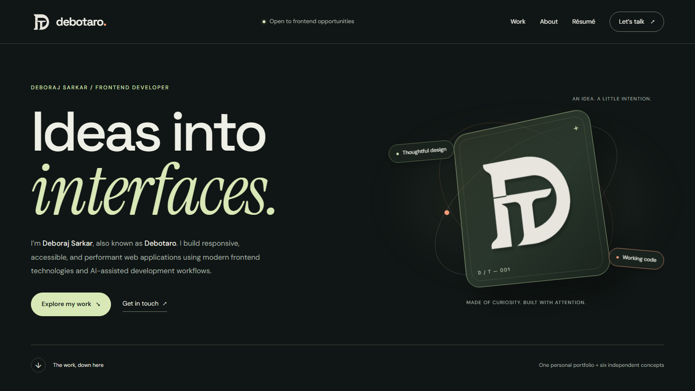
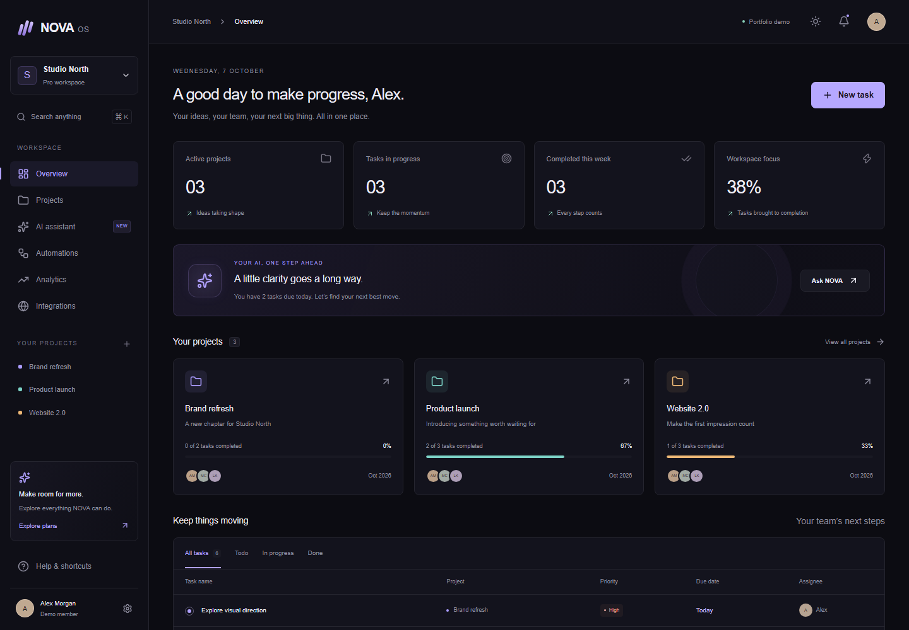
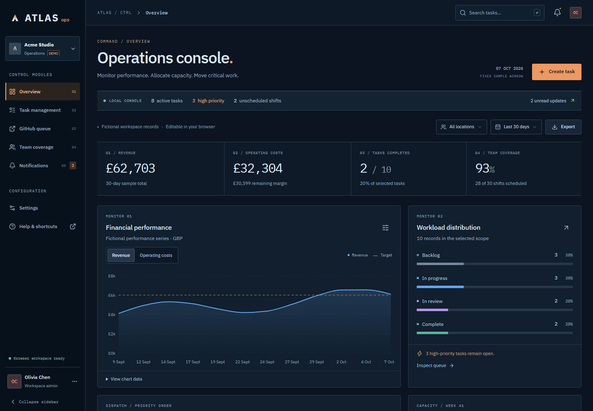
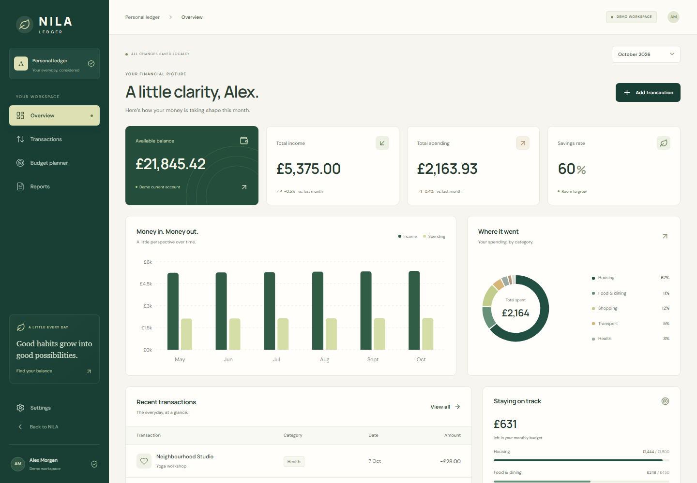
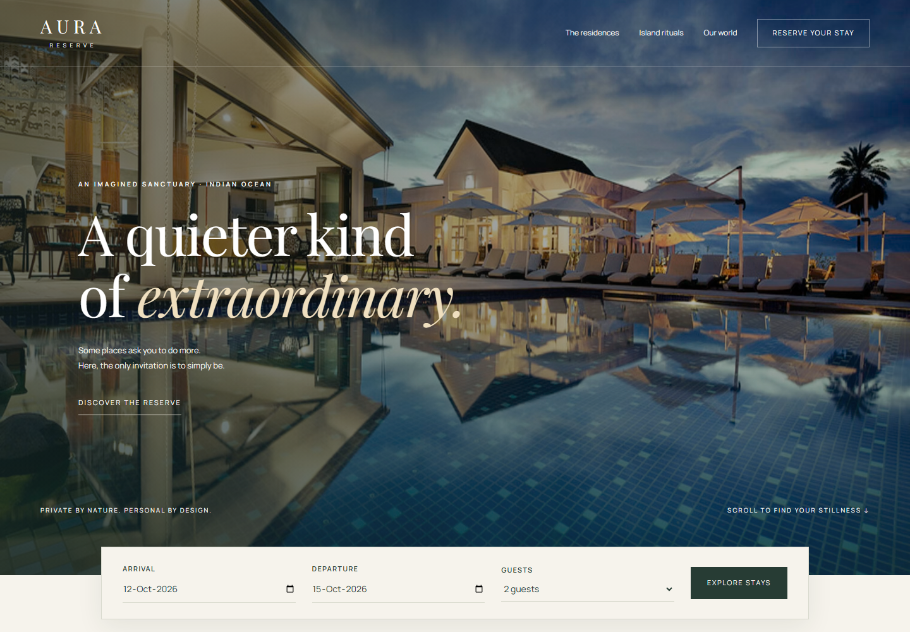
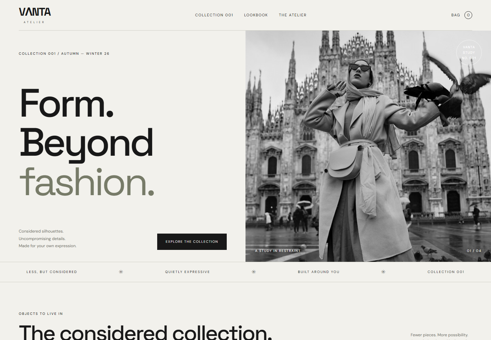
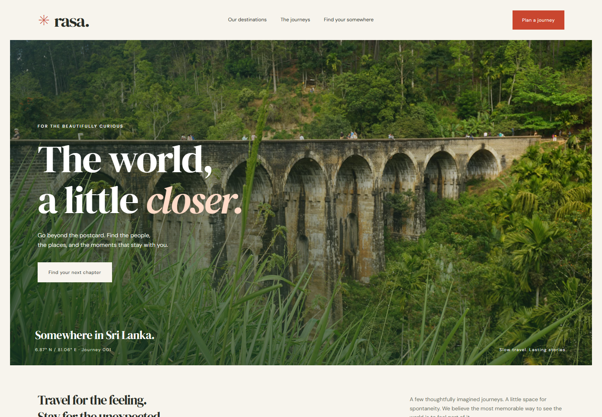

# Deboraj Sarkar (Debotaro) — Portfolio

[](https://github.com/Debotaro/Debotaro.github.io/actions/workflows/pages.yml)

**[View live portfolio](https://debotaro.github.io/)** · **[Download résumé](https://debotaro.github.io/downloads/Deboraj-Sarkar-Resume.pdf)** · **[Read case studies](CASE_STUDIES.md)** · **[Review validation](VALIDATION.md)**

[](https://debotaro.github.io/)

A personal portfolio for **Deboraj Sarkar**, also known as **Debotaro**, focused on frontend job opportunities. The portfolio itself is featured first, followed by six independent, working frontend concepts. The page includes a custom D/T identity, the supplied bio and skills, email and professional profiles, and seven case studies with explicit AI-assisted development and demo scope.

Public availability is phrased as “Open to remote frontend roles and relocation for the right opportunity.” The résumé uses supplied details and verified projects; unconfirmed education and employment are omitted. Contact: `mail.deborajsarkar@gmail.com`. Profiles: GitHub `Debotaro`, LinkedIn `deborajsarkar`, Dribbble `Debotaro`.

## Explore the six demos

Project names open their source folders. Demo links open the published applications.

| Project source | Live demo | Stack | Main interactions |
|---|---|---|---|
| [NOVA OS](nova-os/) | [Open workspace](https://debotaro.github.io/nova-os/app/) | Next.js, TypeScript, Tailwind, Radix, GSAP | Editable projects/tasks, assistant actions, command search, automation flows, analytics, simulated integrations, persistent theme |
| [ATLAS Ops](atlas-ops/) | [Open operations](https://debotaro.github.io/atlas-ops/#/overview) | React, TypeScript, Vite, Tailwind, Radix, Recharts | Task CRUD and Kanban, live GitHub issue queue, safe local issue imports, chart filters/targets, coverage scheduling, notifications, CSV export |
| [NILA Ledger](nila-ledger/) | [Open ledger](https://debotaro.github.io/nila-ledger/#/dashboard) | React, TypeScript, Vite, Tailwind, Recharts, GSAP | Transaction CRUD and filters, accurate penny-based totals, adjustable budgets, CSV exports, printable reports |
| [AURA Reserve](aura/) | [Explore AURA](https://debotaro.github.io/aura/) | One HTML file with embedded CSS/JS, optional GSAP | Property gallery, availability calendar, stay dates, validated enquiry, sample price calculation |
| [VANTA Atelier](vanta/) | [Explore VANTA](https://debotaro.github.io/vanta/) | One HTML file with embedded CSS/JS | Collection filters, lookbook, product sizes, persistent cart, quantities, demo checkout |
| [RASA Experience](rasa/) | [Explore RASA](https://debotaro.github.io/rasa/) | One HTML file with embedded CSS/JS, optional Three.js | Destination globe, itineraries, travel quiz, journey enquiry, downloadable sample plan |

<details>
<summary>View screenshots of all six demos</summary>

### NOVA OS — connected project workspace

[](https://debotaro.github.io/nova-os/app/)

### ATLAS Ops — operational planning

[](https://debotaro.github.io/atlas-ops/#/overview)

### NILA Ledger — personal finance

[](https://debotaro.github.io/nila-ledger/#/dashboard)

### AURA Reserve — hospitality experience

[](https://debotaro.github.io/aura/)

### VANTA Atelier — editorial storefront

[](https://debotaro.github.io/vanta/)

### RASA Experience — travel discovery

[](https://debotaro.github.io/rasa/)

</details>

## Open the complete portfolio

Requirements: Node.js 22.12+ or 24 LTS and npm. The delivered installation was built with Node.js 24.

In PowerShell:

```powershell
Set-Location 'X:\Six Portfolio Projects\portfolio-website'
npm ci
npm run setup
npm run build
npm run preview
```

Open **http://localhost:4173**. The dependencies and builds are already present in this workspace, so you can simply run `npm run preview` here. The preview binds to the local computer only.

`npm run build` builds all three apps and assembles a complete static bundle in `dist/`. It gives NOVA the `/nova-os` base path and retains relative assets in ATLAS and NILA. `npm run dev` serves the same combined preview; it does not run app hot reload. Use the individual commands below while developing an app.

## Develop individual projects

Each app is independently installable and has its own package manifest and lockfile.

```powershell
# NOVA OS — http://localhost:3101
Set-Location 'X:\Six Portfolio Projects\portfolio-website\nova-os'
npm ci
npm run dev

# ATLAS Ops — http://localhost:5174
Set-Location 'X:\Six Portfolio Projects\portfolio-website\atlas-ops'
npm ci
npm run dev

# NILA Ledger — Vite prints its selected port
Set-Location 'X:\Six Portfolio Projects\portfolio-website\nila-ledger'
npm ci
npm run dev
```

For standalone NOVA builds, remove `PORTFOLIO_BASE_PATH` from the environment before running `npm run build`. Its default output is `nova-os/out/`, suitable for a domain root. The combined build sets the path only for its child process, so it does not alter your terminal environment.

The three HTML experiences can also be opened independently through a local static server. The complete HTML/CSS/JavaScript for each lives in its respective `index.html`.

## Tests and screenshots

```powershell
# From portfolio-website, with the production build present:
npm run test:install
npm test
```

Playwright checks the main user journeys at desktop and mobile sizes, data persistence, downloads, keyboard dismissal, CDN fallbacks, runtime errors and document overflow. It starts a preview server if one is not already running. The HTML report appears in `playwright-report/`.

`node scripts/capture.mjs` refreshes the real project screenshots in `previews/`. These images also serve as the portfolio gallery thumbnails. After refreshing them, build again to update `dist/`.

See [VALIDATION.md](VALIDATION.md) for the verified checks and [CASE_STUDIES.md](CASE_STUDIES.md) for the design and engineering rationale.

## Demo behaviour

- All projects use sample data. No backend or server account is required.
- ATLAS's GitHub queue additionally reads real public repository and issue data using credential-free GitHub REST requests. Loading, empty, errors, timeout, rate limits and stale requests are handled. Imports become browser-local tasks; they do not change GitHub. The queue shows one page of up to 30 raw entries with pull requests excluded.
- NOVA's assistant uses deterministic local rules. It creates and updates real local demo tasks, but does not call an AI API.
- Login, signup, onboarding, integration and booking screens are clearly identified simulations. They do not authenticate users, connect services, send email, reserve rooms, purchase products or charge money.
- NOVA, ATLAS, NILA and VANTA store demo state in browser local storage. ATLAS and NILA include confirmed reset controls. Local state belongs to the current browser and origin. Changing the host/port starts a separate storage context.
- Resort and travel enquiry details are used for the on-screen confirmation and are not saved. VANTA does not retain checkout identity or address.
- CSV files and the RASA text itinerary are real downloads. NILA's PDF action opens browser printing; choose **Save as PDF** to create a file. It is not a server PDF generator.
- Fonts, illustrative photographs and optional visual libraries need an internet connection. Native system fonts and accessible controls remain usable if external resources fail. RASA's destination buttons work without WebGL. Photography has replacement comments in the source.

## Source and publishing

Public source: [Debotaro/Debotaro.github.io](https://github.com/Debotaro/Debotaro.github.io). The domain-root GitHub Pages target is [debotaro.github.io](https://debotaro.github.io/). `.github/workflows/pages.yml` installs the locked dependencies, builds all six projects, runs desktop/mobile browser checks, and deploys the verified `dist/` artifact on `main`. Pull requests run the same checks without deploying. The Pages source is configured as GitHub Actions.

**Three single-file experiences:** publish the contents of `aura/`, `vanta/` or `rasa/` as a GitHub Pages source, with `index.html` at its root. Their footer portfolio link is relative to their parent; update it to your portfolio URL if you host them separately. GitHub's [Pages setup documentation](https://docs.github.com/en/pages/getting-started-with-github-pages/creating-a-github-pages-site) explains publishing sources and disabling Jekyll.

**Individual apps on Vercel:** import your repository and set the project root directory to `nova-os`, `atlas-ops` or `nila-ledger`. Use the matching Next.js or Vite framework preset. Leave `PORTFOLIO_BASE_PATH` unset for standalone NOVA. ATLAS/NILA use hash routes, so they do not require a route rewrite. Their project READMEs contain further details. See [Vercel Git deployment](https://vercel.com/docs/git) and [Vite on Vercel](https://vercel.com/docs/frameworks/frontend/vite).

**One combined static deployment:** publish the contents of the built `dist/` directory. It includes all six projects, the gallery and `.nojekyll`. For a domain root, use the default build. For a GitHub project URL such as `https://yourname.github.io/my-portfolio/`, set the base before building:

```powershell
$env:PORTFOLIO_SITE_BASE = '/my-portfolio'
npm run build
Remove-Item Env:PORTFOLIO_SITE_BASE
```

NOVA requires that prefix at build time; ATLAS, NILA and the static pages retain relative links. A bundle built with a repository prefix must be served at that prefix. This local preview server expects the default domain-root build, so rebuild without the variable before local QA.

When hosting apps separately, change the matching gallery links in the root `index.html` and the `routes` map in `assets/portfolio.js` to their final public URLs. The source-link mapping lives beside those routes. Case-study content lives in `data/case-studies.json`; keep future process notes and claims tied to work you can explain. Generated logo files and prompts are documented in `assets/LOGO.md`.

## Job application materials

`downloads/Deboraj-Sarkar-Resume.pdf` is a one-page text-based résumé, linked in the navigation and contact section. `downloads/Deboraj-Sarkar-Resume.html` is an editable printable version. Content is also maintained in `career/resume.json` and `career/RESUME.md`. Regenerate the PDF/HTML with `python career/build_resume.py` after installing `reportlab`; this task used the Codex bundled Python runtime and inspected the rendered PDF page.

`career/INTERVIEW_PREPARATION.md` contains project pitches, actual source/data flows, frontend Q&As, code exercises, a five-day practice schedule and honest AI-assistance talking points. Use the exercises to build your own understanding and learning log before presenting sample answers as demonstrated skills.

## Structure

```text
portfolio-website/
  index.html           Personal portfolio page
  assets/              Portfolio CSS/JS and generated Debotaro identity
  data/                Seven editable case studies
  career/              Résumé content and interview preparation
  downloads/           Public résumé PDF and printable HTML
  .github/workflows/   Validated GitHub Pages deployment
  nova-os/             Independent Next.js project
  atlas-ops/           Independent Vite project
  nila-ledger/         Independent Vite project
  aura/index.html      Single-file resort
  vanta/index.html     Single-file shop
  rasa/index.html      Single-file travel experience
  previews/            Real desktop/mobile project screenshots
  scripts/             Install, build, serve and capture helpers
  tests/               Playwright user-journey checks
  dist/                Complete built static portfolio (generated)
```
