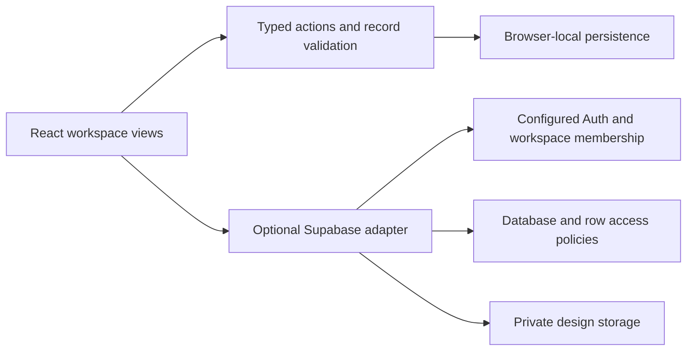

# RELAY OS — creative project handoffs

[Open the public demo](https://debotaro.github.io/relay-os/) · [Return to Debotaro's portfolio](https://debotaro.github.io/) · [Review collection validation](../VALIDATION.md)

RELAY connects project planning, design revisions, pinned feedback and approval decisions in one creative workspace. It is the seventh independent concept in Deboraj Sarkar's portfolio, developed with AI assistance. The public demo uses labelled sample projects and saves work in the current browser. Demo roles preview different workflows; switching a role does not authenticate a real user.

The interface is an artwork-led review studio: a horizontal studio masthead, visual project covers, a featured review with its feedback brief, and a wide design canvas beside the conversation. Project covers open that project's designs; the review journey and approval labels derive from the selected revision's actual state. Mobile navigation supports Escape and returns focus to its opener. Light and dark themes keep the same studio layout.

## Why React, TypeScript and Vite

This app has interactive workspace views and no server-rendered content requirement. Vite's static output, relative assets (`base: './'`) and hash routes fit the existing GitHub Pages portfolio alongside the six earlier projects. React shares the domain state across views; TypeScript describes its records and actions. The optional Supabase adapter is a separate boundary for externally configured authentication and persistence. This keeps the public demonstration runnable without cloud credentials.

## Run the app

Use Node.js 22.12+ or 24 LTS and npm. From this directory:

```powershell
npm ci
npm run dev
```

The development server is **http://localhost:5176**. Build and preview the standalone static app with:

```powershell
npm run build
npm run preview
```

The preview is **http://localhost:4176**. `npm run build` checks TypeScript before generating `dist/`.

For the integrated portfolio, run `npm run setup`, `npm run build` and `npm run preview` from the repository root, then open **http://localhost:4173/relay-os/**. The root build copies RELAY's static output into the complete website. The GitHub Actions workflow installs locked dependencies, validates the collection and publishes the verified artifact to Pages.

## A short demonstration

1. Open the overview and inspect the featured artwork, feedback brief and review journey. Open a project cover to review its designs.
2. Create a project, add a task and change its status. Show that project progress reflects the same task records.
3. Open the Forma design review. Add feedback directly on the image, then convert the comment into a linked task. Repeated conversion cannot create another task for the same comment.
4. Add a new revision and review its version history. A decision belongs to the selected revision; approved versions stay final, and later changes need a new revision.
5. Switch to the Client demo role. Explain which actions remain available and why project/task management is restricted. Make a review decision and inspect the activity trail.
6. Use command search to navigate to work, then reload and show browser-local persistence. Return to the Project Manager role for editing.

These are sample team members and clients. The demonstration is not evidence of real employment or customer usage.

## Domain and permissions

`src/domain.ts` owns record validation, the pure action reducer, role helpers and sample seed. Projects link tasks and assets. Each asset revision references its predecessor; comments link to their exact asset and may reference one converted task. Activity entries record local changes. Overview and analytics derive their values from these records rather than maintaining separate totals.

| Action                                         | Admin | Project Manager | Designer | Client |
| ---------------------------------------------- | ----- | --------------- | -------- | ------ |
| Create, edit, archive or delete a project      | Yes   | Yes             | No       | No     |
| Manage tasks and upload design revisions       | Yes   | Yes             | Yes      | No     |
| Add feedback                                   | Yes   | Yes             | Yes      | Yes    |
| Convert feedback to a task                     | Yes   | Yes             | Yes      | No     |
| Request review from draft or changes requested | Yes   | Yes             | Yes      | No     |
| Make an approval decision                      | Yes   | Yes             | No       | Yes    |

Designers and managers can resolve feedback; a client can resolve their own feedback. An archived project must be restored before editing its work. Deleting a project removes its linked local records. Removing an asset removes its later revisions and comments; deleting a converted task clears the comment's task link. These rules are enforced by the demo domain reducer as well as exposed through the interface.

The demo permissions are a product behaviour example. Browser code and a role selector are not a security boundary. Real authenticated use also needs backend membership and access policies.



## Storage and upload scope

The public demo works with local records and labelled sample content. Uploaded demo PNG, JPEG and WebP images are limited to 1 MiB each; the domain permits up to 3 MiB for externally stored images. Seed artwork is an SVG shipped with the app. Pin coordinates are normalized from 0 to 1 and rendered as percentages so their positions track the displayed image dimensions. They annotate an image; the app is not a collaborative design editor or drawing tool.

Saved data is treated as untrusted input. Validation checks record types, safe image URLs, sizes, status values, dates, IDs, revision history and relationships. Supported workspace limits are 100 projects, 1,000 tasks, 300 asset revisions, 2,000 comments and 200 activity entries. Saved strings are limited to 3,500,000 characters. This bounds a demonstration workspace rather than promising unlimited storage. Browser quotas and private browsing may limit saving further.

Local state belongs to the current browser and origin. Opening a different host or port starts a different storage context. It is not a shared cloud database, multi-device sync, cross-user collaboration or a recoverable backup. Avoid using the demo as the sole copy of important work.

## Optional backend

The repository includes a Supabase adapter and database/private-storage policy source for a separately configured backend. The public GitHub Pages demo starts in browser-local mode and does not ship an authenticated workspace or live cloud credentials.

To enable real cloud mode, follow [the Supabase setup guide](supabase/README.md) after creating a Supabase project. It requires applying the migration, configuring the permitted authentication redirect, supplying `VITE_SUPABASE_URL` and `VITE_SUPABASE_PUBLISHABLE_KEY`, and establishing workspace membership. Private server credentials must remain outside the static website. Verify denied access, roles and storage behaviour against that configured backend before treating it as a shared service.

`src/repository.ts` implements the SDK data and private-storage boundary. `src/useRelay.ts` separates demo persistence from configured authentication, membership, database updates and realtime subscriptions. The backend guide describes signup-created admin workspaces and invitations for existing members. Test-only embedded Postgres checks exercise the migration and access rules against authentication/storage stubs. Live Supabase authentication, storage and realtime have not been exercised against a configured service; embedded checks do not establish those outcomes. See [VALIDATION.md](../VALIDATION.md) for the completed results.

No deployed cloud backend, live team collaboration, audited security, compliance certification or formal accessibility conformance is claimed. Email notifications, a service worker/PWA and a collaborative drawing surface are outside this demo's scope.

## Verification and source

Run the domain and backend contract checks in this directory:

```powershell
npm test
```

From the repository root, `npm run test:unit` runs the same RELAY package checks and `npm test` runs Playwright against the built portfolio, including RELAY's workflow checks and the seven-app gallery. The latest results and their practical limits are recorded in [VALIDATION.md](../VALIDATION.md). Domain checks exercise record relationships and permissions; embedded Postgres checks use authentication/storage stubs; browser checks verify specific interactions. They do not by themselves audit an external backend or establish complete browser/accessibility coverage.

Useful reading order: `src/domain.ts`, `src/useRelay.ts`, the views under `src/`, `src/repository.ts`, [backend setup](supabase/README.md), and `tests/` plus the root `tests/relay.spec.ts`. Trace one action from its handler through the reducer to a rendered result before presenting it in an interview. [Interview preparation](../career/INTERVIEW_PREPARATION.md) includes an honest RELAY pitch and a permission-boundary exercise.

## Publish

The canonical deployment is the repository's existing GitHub Actions Pages workflow. It serves this app at `/relay-os/` alongside the portfolio and six earlier demos; no additional project or hosting account is required for browser-local mode.

For a standalone static host, publish this app's generated `dist/` directory. Relative asset paths and hash navigation work at a domain root or subdirectory. Keep the trailing slash on a subdirectory URL. Backend setup is separate from static publishing; deploying the frontend does not provision Supabase.
