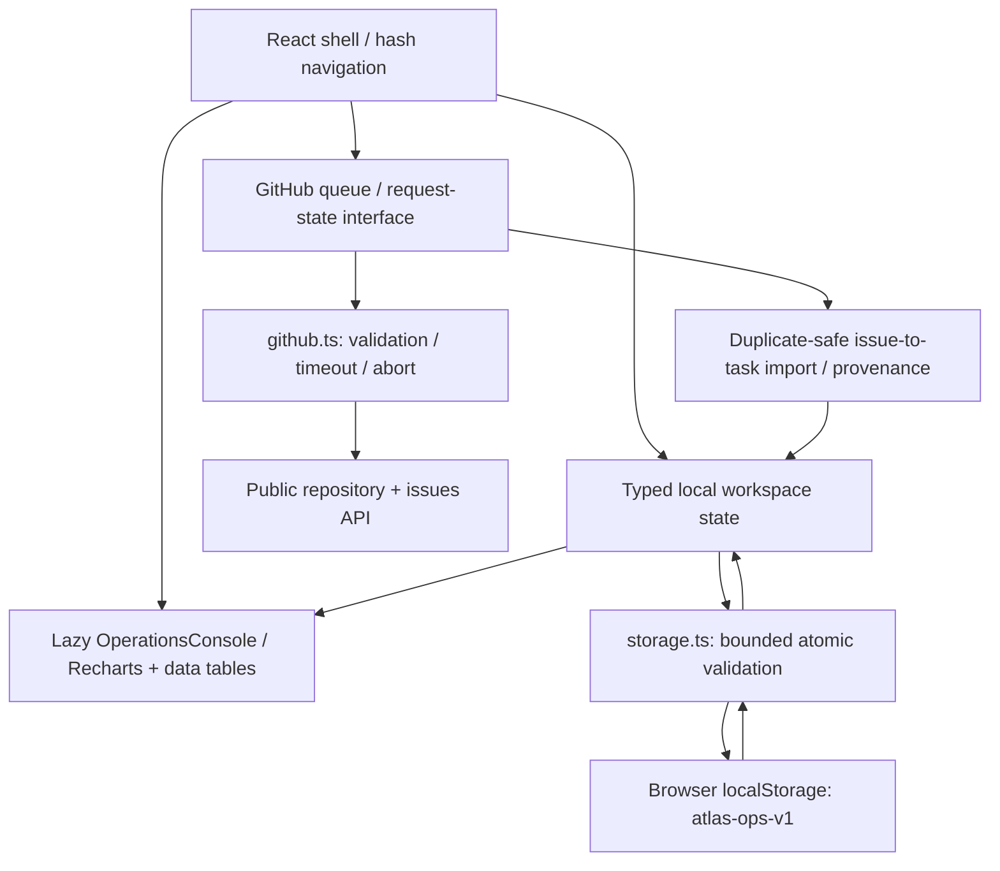

# ATLAS Ops — external issues, local operations

[Open the demo](https://debotaro.github.io/atlas-ops/) · [Collection case studies](../../CASE_STUDIES.md) · [Source](../../atlas-ops/)

ATLAS is a personal operations concept built with React, TypeScript, Vite and Recharts. It joins an editable local task board with a live public GitHub issue queue. The design challenge is to make dense operational information readable while clearly identifying which records come from an external source.

An indexed navigation rail, telemetry strip, compact financial charts, regional coverage and an intervention queue establish a technical monitoring identity. Its density contrasts with NOVA’s calm personal agenda. Operational figures and staffing are fictional sample data; GitHub repository and issue reads use the public API.

**Deboraj’s contribution:** visual direction, interface review and iteration, with AI-assisted implementation. Deboraj reviewed the generated experience, requested revisions and selected the final direction. Codex supported implementation and automated validation. The project claims working demo behaviour, rather than independent coding authorship or measured business impact.

## Architecture

The [application shell](../../atlas-ops/src/App.tsx) owns state, navigation and edits. [OperationsConsole](../../atlas-ops/src/OperationsConsole.tsx) loads on opening the overview, keeping its chart dependencies off the landing page. The [GitHub boundary](../../atlas-ops/src/github.ts) validates response shapes, constructs canonical links and handles network, timeout and rate-limit failures. [GitHubQueue](../../atlas-ops/src/GitHubQueue.tsx) presents explicit loading, success, empty and recovery states; cleanup prevents obsolete responses replacing the current repository.

## A concrete walkthrough

1. Enter the overview and inspect the financial charts alongside their data table. Change the period or location to explore the illustrative figures.
2. Open the GitHub queue and load a public repository. Filter the fetched page by issue title, number, author or labels.
3. Import an issue. It becomes a local backlog task with a source ID, repository, issue number, canonical URL and import timestamp. Re-importing the same issue does not create another task.
4. Open local tasks, edit the task and move it through an explicit status control or drag-and-drop. Its GitHub source link remains available; no remote issue is modified.
5. Reload to verify saved changes. Review coverage, adjust a target or export the sample financial data as CSV to demonstrate the surrounding local workflow.

## Implementation decisions

TypeScript describes expected records, while [runtime storage validation](../../atlas-ops/src/storage.ts) checks unknown saved data before rendering. Nested fields, dates, enums, unique IDs, bounded collections and canonical GitHub provenance must all be valid. Restoration is atomic: one malformed record rejects the snapshot instead of silently dropping selected entries.

[Persistence helpers](../../atlas-ops/src/data.ts) retain an invalid raw snapshot when displaying the sample fallback. The initial autosave skips that recovered state object; an intentional edit or reset creates a new object that can be saved. This preserves recovery evidence while keeping the demo usable. Unavailable storage produces a session-only warning rather than blocking task work.

Unauthenticated public reads simplify static deployment, at the cost of rate limits and a limited query. ATLAS fetches one page of up to 30 raw entries and excludes pull requests, so the visible issue count may be lower. Search operates on that fetched page; pagination and repository-wide search remain future work. Requests time out after 12 seconds and can be retried.

## Verified evidence and limits

The [validation report](../../VALIDATION.md) records build and browser outcomes. [API regressions](../../tests/atlas-api.spec.ts) cover imports, persistence, search, malformed responses, rate limits, timeout and obsolete requests. [Storage unit checks](../../atlas-ops/qa/storage.test.mjs) and [browser restoration tests](../../tests/storage-validation.spec.ts) exercise malformed snapshots and valid custom state.

The collection’s [accessibility review](../ACCESSIBILITY.md) includes ATLAS overview, task and editor states among its 46 scans with zero reported axe violations. It records stronger sidebar-label contrast and restored dialog focus, while retaining uncertain findings and unperformed screen-reader/physical-device checks. The [performance report](../performance/README.md) documents deferred chart delivery and controlled lab conditions, not field performance guarantees.

There is no ERP connection, live staffing feed, authenticated planning backend or cloud synchronisation. Imported tasks remain local, and ATLAS never writes GitHub.
