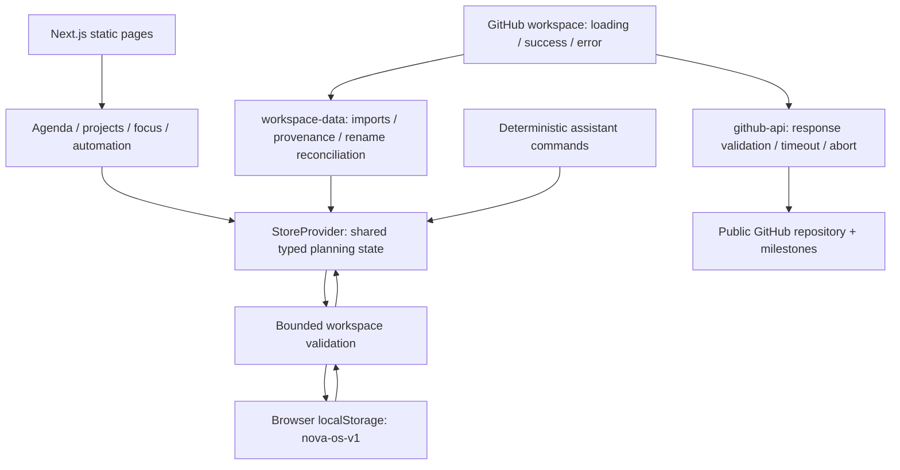

# NOVA OS — a personal planning canvas

[Open the demo](https://debotaro.github.io/nova-os/app/) · [Collection case studies](../../CASE_STUDIES.md) · [Source](../../nova-os/)

NOVA is a personal concept built with Next.js, React, TypeScript and Tailwind CSS. Its central question is practical: how can public repository context become useful daily planning without making a local demo appear to synchronise with GitHub?

The interface answers with a calm daily agenda, a task-linked focus pane and project notebooks. Warm surfaces, lavender accents and a compact top ribbon give it a different rhythm from ATLAS’s dense monitoring console. Project progress, assistant actions and automation use the same planning records, so moving between views preserves context.

**Deboraj’s contribution:** visual direction, interface review and iteration, with AI-assisted implementation. Deboraj reviewed the generated interfaces, requested changes and made the final design decisions. The source and automated checks were produced with Codex assistance; this story does not claim independent coding authorship or commercial outcomes.

## Architecture

The [store](../../nova-os/components/store.tsx) owns local state and persistence. [Workspace helpers](../../nova-os/components/workspace-data.ts) validate nested records and relationships, prevent duplicate imports and reconcile a verified repository rename using GitHub’s stable repository ID. The [API boundary](../../nova-os/components/github-api.ts) validates remote data and constructs canonical source links. Requests have a 12-second deadline; changing repositories or leaving the view aborts obsolete work.

## A concrete walkthrough

1. Open the workspace and visit its GitHub view. Load a public repository with open milestones; a repository without milestones has a usable empty state.
2. Import the repository as a local project, then import a milestone as one task. Source metadata retains its repository, milestone number, GitHub ID, URL and import time.
3. Find the task in local planning, adjust its status and use the focus pane to complete it. Local progress updates without changing GitHub.
4. Ask the assistant to summarise the project or use `Create task:` followed by a task name. These are deterministic commands, rather than calls to an AI service.
5. Reload to inspect saved work and source links. When storage is unavailable, the interface explains that changes last only for the current session.

## Implementation decisions

One shared React state keeps derived progress and task actions consistent without introducing a backend. Functional updates let a delayed assistant action use current state rather than overwrite intervening edits. Clearing chat or leaving the assistant cancels pending actions.

Public reads require no credentials, but fetch only one page of at most 30 open milestones. Search filters that page; it is not repository-wide search. A milestone becomes one planning task, not an import of its constituent issues. Duplicate checks protect stable source IDs, while import activity retains up to 100 entries.

Storage is validated before restoration and saving. Invalid saved data restores the sample workspace and announces recovery; a subsequent successful save replaces that invalid snapshot. Browser storage is convenient for a static demo, but provides neither multi-device continuity nor team collaboration.

## Verified evidence and limits

The [validation report](../../VALIDATION.md) records build and browser evidence. Dedicated regressions cover [API failures and cancellation](../../tests/nova-github-api.spec.ts), [imports, reload and canonical renames](../../tests/nova-github-workspace.spec.ts), and [delayed assistant state preservation](../../tests/nova-assistant-state.spec.ts).

The collection’s [accessibility review](../ACCESSIBILITY.md) reports zero axe violations across 46 sampled desktop/mobile scans, including NOVA states, and documents dialog focus, heading and reduced-motion dark-theme fixes. Uncertain contrast results, screen-reader sessions and physical-device checks remain outside that completed evidence. The [performance report](../performance/README.md) explains the matched lab measurements and hero-visibility correction; it does not establish field Core Web Vitals.

Authentication, private repositories, other integrations and team collaboration remain simulated. NOVA performs public reads and local planning; it has no cloud synchronisation, GitHub writes or production AI backend.
